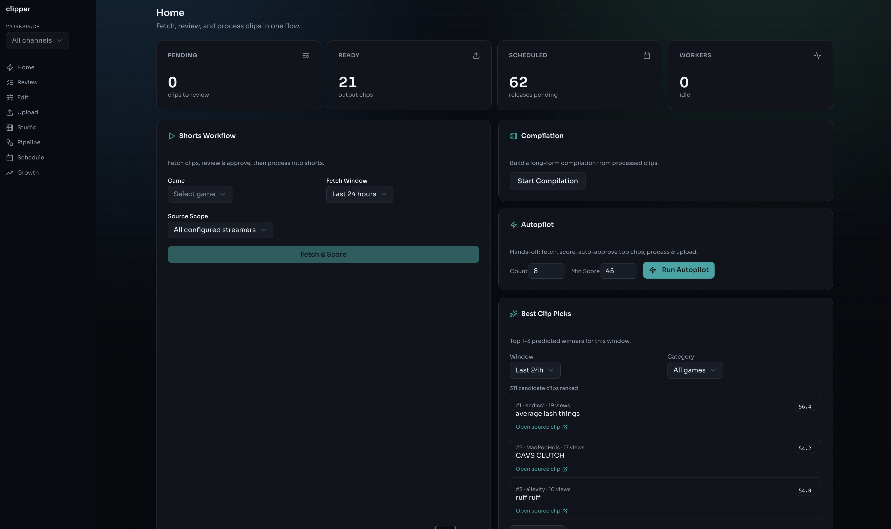
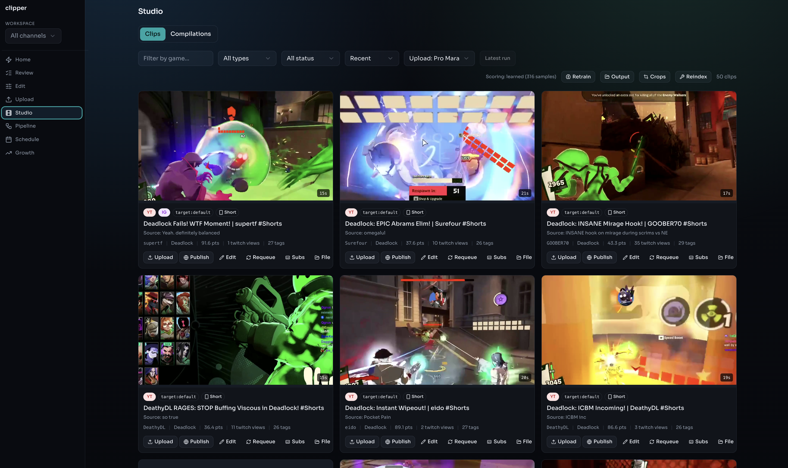
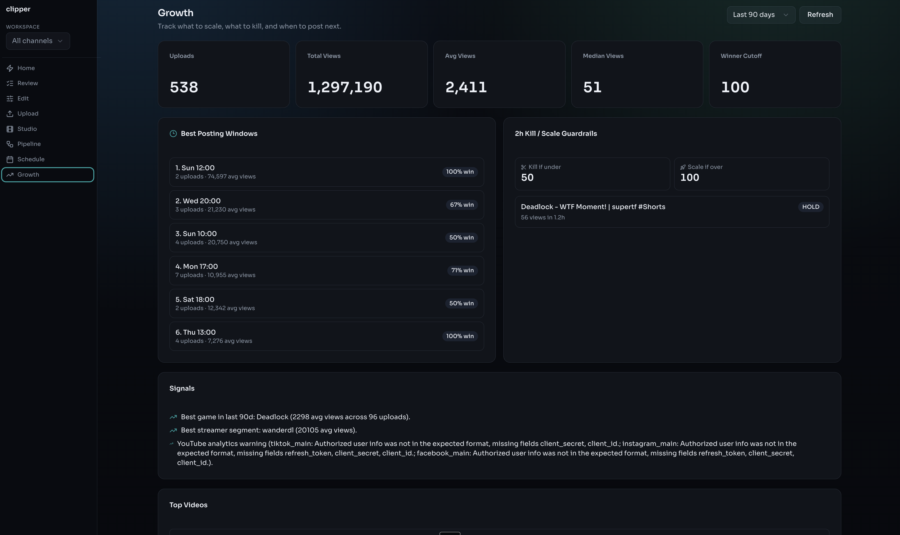

<div align="center">

# AUTOPILOT

**Fully automated short-form content pipeline**

Discovers top Twitch clips, scores and ranks them, reformats for vertical video,
<br>adds subtitles and overlays, and publishes across 4 platforms — every day, zero manual input.

<br>

<table>
<tr>
<td align="center"><h2>2M+</h2>YouTube views<br><sub>first 30 days</sub></td>
<td align="center"><h2>700K</h2>Instagram views<br><sub>first 3 days</sub></td>
<td align="center"><h2>538</h2>videos uploaded<br><sub>fully automated</sub></td>
<td align="center"><h2>4</h2>platforms<br><sub>simultaneous cross-post</sub></td>
</tr>
</table>

<br>


</div>

---

### Dashboard

Pipeline controls, autopilot triggers, and real-time clip recommendations.



### Studio

Review, approve, and edit clips before they go out. Each card shows the thumbnail, score, streamer, and platform targets.



### Analytics

Track total views, best posting windows, and per-video performance. Scoring weights retrain automatically based on what actually gets views.



---

## How it works

Every morning at 7am, the pipeline runs unattended:

**Discover** — Pulls hundreds of clips from the Twitch Helix API, filtered by game and streamer. Deduplicates against a history of 14K+ previously seen clips.

**Score + Screen** — Each clip is ranked by view velocity, duration, audio quality, and title keywords. Scoring weights are trained from actual upload performance — the system learns what gets views on each channel. Top candidates are then screened by Gemini for content quality.

**Process** — Clips are converted from 16:9 → 9:16 vertical format. The facecam is auto-detected and cropped to fill the top band. Gameplay is zoomed and repositioned with the HUD overlaid at the bottom. Each streamer has a calibrated layout profile (55+ profiles stored). Whisper generates word-level subtitles with karaoke-style highlighting. FFmpeg composites everything: subtitles, hook text, progress bar, and platform-specific CTA animations.

**Publish** — Clips are uploaded to YouTube with `publishAt` scheduling across peak hours, then cross-posted to Instagram, TikTok, and Facebook with per-platform throttling. Daily highlight compilations are assembled automatically with transition cards between clips.

**Learn** — After upload, the system tracks views and engagement. Scoring weights are periodically retrained so clip selection improves over time. The analytics dashboard surfaces best posting windows and top-performing streamer segments.

## Daily schedule

| Time | What happens |
|:---|:---|
| 7:00 AM | Fetch clips from Twitch, score and approve top candidates |
| 7:05 AM | Format, subtitle, and burn overlays (3 clips processed in parallel) |
| 7:35 AM | Upload 7 Shorts to YouTube, scheduled across peak hours |
| 7:40 AM | Build and upload daily highlight compilation |
| 8:00 AM | Marathon channel runs the same pipeline independently |
| 9:00 AM | Cross-post top performers to Instagram, TikTok, Facebook |
| Every 5 min | Release executor publishes any uploads whose scheduled time has arrived |

Runs via launchd cron on macOS. The web dashboard is for reviewing clips and monitoring performance — not required for daily operation.

## Stack

| | |
|:---|:---|
| **Pipeline + API** | Python, FastAPI, SSE streaming |
| **Video** | FFmpeg via imageio-ffmpeg (libass, loudnorm, concat demuxer) |
| **Speech-to-text** | Whisper with word-level alignment |
| **Content AI** | Gemini for screening, titles, descriptions, captions |
| **Database** | SQLite in WAL mode with auto-migration |
| **Frontend** | React, TypeScript, shadcn/ui, Vite |
| **Downloads** | yt-dlp |
| **Platforms** | YouTube Data API v3, Instagram Graph API, TikTok, Facebook Reels |

## Setup

```bash
pip install -r requirements.txt
cp .env.example .env            # Twitch, Meta, TikTok, Gemini API keys
python -m clipper auth           # OAuth setup for each platform
python -m clipper serve          # API + web UI → localhost:8420
```

All behavior is driven by `config.yaml` — streamer lists, scoring thresholds, daily caps, posting schedules, layout preferences. No secrets in config; credentials live in `.env` and OAuth token files.
